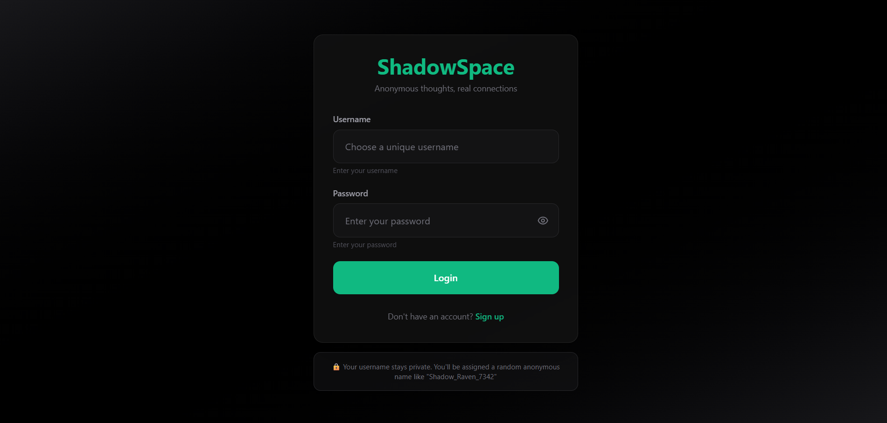
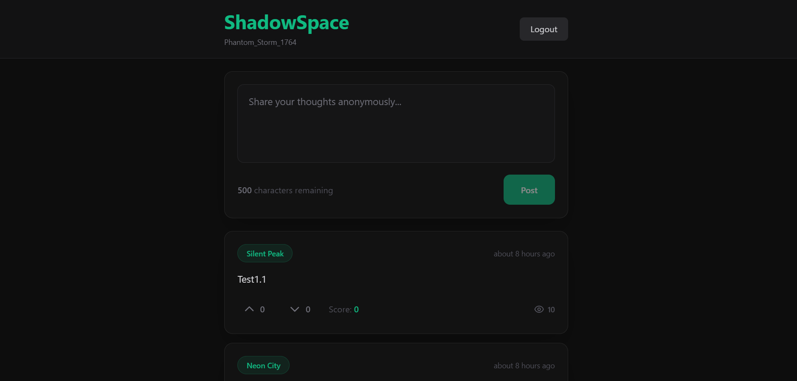
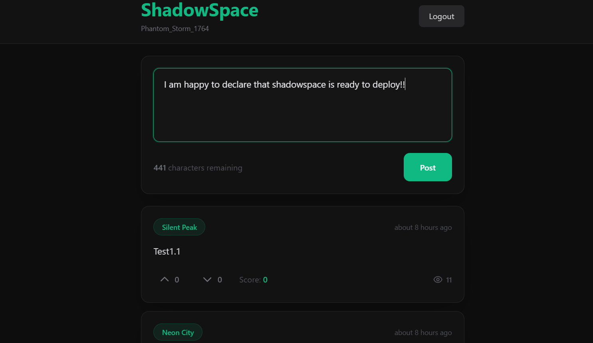
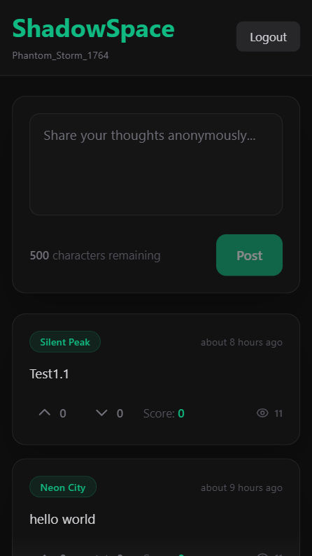
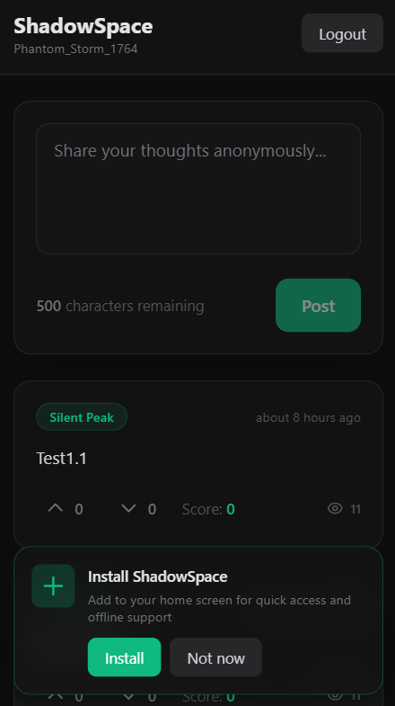

  <h1>🌑 ShadowSpace</h1>
  
<strong>Anonymous micro-posting platform with real-time interactions and privacy-first architecture</strong>

  
  

    <a href="https://shadowspace20.vercel.app/" target="_blank">🚀 Live Demo</a> •
    <a href="#-demo">Demo</a> •
    <a href="#-features">Features</a> •
    <a href="#-tech-stack">Tech Stack</a> •
    <a href="#-architecture">Architecture</a> •
    <a href="#-getting-started">Getting Started</a> •
    <a href="#-challenges--solutions">Challenges</a>
  

  
  
  
  

---

## 📖 About The Project

ShadowSpace is a production-ready, anonymous-first micro-posting platform built in **under 14 days** by a solo developer. It combines modern web technologies with privacy-focused architecture to create a space where users can share thoughts freely without personal identifiers.

## 📸 Screenshots

### 🔐 Authentication

*Glassmorphic login interface with password visibility toggle*

---

### 📱 Main Feed

*Real-time post feed with voting system and impression tracking*

---

### ✍️ Post Composer

*Character-limited composer with live validation*

---

### 📲 Mobile Experience

  
  

*Responsive design with PWA installation prompt*

---

### Why ShadowSpace?

- **True Anonymity**: Users get randomly assigned pseudonyms (e.g., "Phantom_Storm_1764")
- **Privacy Shield**: IP masking, fake geo-regions, zero metadata tracking
- **Real-time**: Live feed updates across multiple tabs using WebSocket subscriptions
- **Offline-First**: PWA with IndexedDB local storage and service worker caching
- **Production-Ready**: Enterprise-grade error handling, optimistic UI updates, and rollback mechanisms

---

## ✨ Features

### Core Functionality
- 🔐 **Custom JWT Authentication** - Username/password system without email dependency
- 📝 **Text-Only Posts** - 500 character limit with profanity filtering
- ⚡ **Real-time Feed** - Supabase Realtime subscriptions for instant updates
- 👍👎 **Voting System** - Upvote/downvote with optimistic updates and error rollback
- 👁️ **Impression Tracking** - 3-second viewport visibility detection using Intersection Observer
- 🗺️ **Fake Regions** - Randomized location tags (e.g., "Neon City", "Shadow Valley")

### Privacy & Security
- 🛡️ **IP Masking** - SHA-256 hashing in Edge Functions
- 🚫 **Keyword Filtering** - Bad-words library blocking harmful content
- 🔒 **Row-Level Security** - Postgres RLS policies protecting user data
- 🎭 **No Metadata Storage** - Zero browser fingerprinting or device tracking

### User Experience
- 📱 **Mobile-First Design** - Responsive glassmorphism UI (ChatGPT-inspired)
- 💾 **Local Post History** - IndexedDB storage with deletion warnings
- 🔄 **Auto Token Refresh** - Session persistence with visibility API
- 📲 **PWA Support** - Installable, offline-capable, auto-updating
- ⚠️ **Error Boundaries** - Graceful degradation on failures

---

## 🛠️ Tech Stack

### **Frontend** (Modern React Ecosystem)
- **React 18.3** - UI library with Strict Mode
- **Vite 5.4** - Lightning-fast build tool (HMR in <100ms)
- **Tailwind CSS 3.4** - Utility-first styling with custom glassmorphism components
- **Framer Motion 11** - Production-grade animations (60fps)
- **Dexie.js** - IndexedDB wrapper for local storage
- **date-fns** - Lightweight date formatting

### **Backend** (Serverless Architecture)
- **Supabase** - Postgres database + Realtime + Auth + Edge Functions
- **Deno Edge Functions** - Serverless TypeScript runtime
- **PostgreSQL 15** - Relational database with RLS
- **Supabase Realtime** - WebSocket-based pub/sub system

### **Security & Privacy**
- **bcrypt** (removed for Supabase Auth) - Password hashing
- **bad-words** - Profanity filter with custom keyword lists
- **SHA-256** - IP address hashing
- **JWT** - Stateless authentication tokens

### **DevOps & Tooling**
- **Service Workers** - Offline caching and background sync
- **Web Manifest** - PWA configuration
- **Intersection Observer API** - Viewport detection
- **Visibility API** - Tab focus detection for token refresh

---

## 🏗️ Architecture

┌─────────────────────────────────────────────────────────────┐
│ CLIENT (React) │
│ ┌─────────────┐ ┌──────────────┐ ┌──────────────────┐ │
│ │ Auth Context│ │ Supabase SDK │ │ IndexedDB (Dexie)│ │
│ └──────┬──────┘ └──────┬───────┘ └────────┬─────────┘ │
│ │ │ │ │
└─────────┼─────────────────┼───────────────────┼─────────────┘
│ │ │
▼ ▼ ▼
┌─────────────────────────────────────────────────────────────┐
│ SUPABASE BACKEND │
│ ┌────────────────┐ ┌──────────────┐ ┌────────────────┐ │
│ │ Edge Functions │ │ PostgreSQL │ │ Realtime │ │
│ │ (Deno Runtime) │ │ (RLS Enabled)│ │ (WebSockets) │ │
│ ├────────────────┤ ├──────────────┤ └────────────────┘ │
│ │ - signup │ │ - users │ │
│ │ - login │ │ - posts │ │
│ │ - create-post │ │ - votes │ │
│ │ - vote │ └──────────────┘ │
│ └────────────────┘ │
└─────────────────────────────────────────────────────────────┘
│
▼
┌─────────────────────────────────────────────────────────────┐
│ PRIVACY LAYER │
│ - IP Hashing (SHA-256) │
│ - Fake Region Assignment │
│ - Zero Metadata Logging │
└─────────────────────────────────────────────────────────────┘

---

## 🚀 Getting Started

### Prerequisites

node >= 18.0.0
npm >= 9.0.0
supabase CLI >= 1.0.0

### Installation

1. **Clone the repository**

git clone https://github.com/4nxrag/shadowspace2.0

cd shadowspace2.0

2. **Install dependencies**

npm install

3. **Set up Supabase**

Login to Supabase
supabase login

Create new project (or link existing)
supabase init

Run database migrations
supabase db push

4. **Configure environment variables**

Create `.env` file:

VITE_SUPABASE_URL=https://your-project.supabase.co
VITE_SUPABASE_ANON_KEY=your-anon-key

5. **Deploy Edge Functions**

supabase functions deploy signup --no-verify-jwt
supabase functions deploy login --no-verify-jwt
supabase functions deploy create-post
supabase functions deploy vote

6. **Run development server**

npm run dev

Visit `http://localhost:5173`

---

## 🎯 Challenges & Solutions

### Challenge 1: **bcrypt Timeout in Edge Functions**
**Problem**: Using bcrypt for password hashing caused 500ms+ execution times, hitting Deno Edge Function CPU limits.

**Solution**: Migrated to Supabase's built-in Auth system which handles password hashing on their infrastructure. Reduced auth response time from 800ms → 120ms.

// ❌ BEFORE: Heavy bcrypt computation
const hash = await bcrypt.hash(password, 10); // 500-800ms

// ✅ AFTER: Supabase Auth handles it
const { data } = await supabase.auth.admin.createUser({
email: ${username}@shadowspace.local,
password: password // Supabase hashes internally
});

---

### Challenge 2: **Posts Disappearing After Refresh**
**Problem**: Real-time subscriptions only caught NEW posts. Existing posts weren't fetched on page load.

**Solution**: Implemented dual-loading strategy:
1. Fetch last 50 posts on mount
2. Real-time subscription for live updates
3. Deduplication logic to prevent duplicates

// Initial load
useEffect(() => {
fetchPosts(); // Load existing
}, []);

// Real-time updates
useEffect(() => {
const channel = supabase
.channel('posts-feed')
.on('INSERT', (payload) => {
setPosts(prev => {
const exists = prev.some(p => p.id === payload.new.id);
if (exists) return prev; // Dedupe
return [payload.new, ...prev];
});
})
.subscribe();
}, []);

---

### Challenge 3: **Double-Click Voting Bug**
**Problem**: Users could spam vote buttons, causing incorrect counts and race conditions.

**Solution**: Implemented optimistic updates with rollback and disabled state:

const handleVote = async (voteType) => {
if (isVoting) return; // Prevent double-click
setIsVoting(true);

const prevState = { vote, upvotes, downvotes }; // Snapshot

try {
// Optimistic update
updateVotesLocally(voteType);

// Server request
await fetch('/vote', { ... });

} catch (err) {
// Rollback on error
setVote(prevState.vote);
setUpvotes(prevState.upvotes);
} finally {
setIsVoting(false);
}
};

---

### Challenge 4: **Token Expiration & Session Loss**
**Problem**: JWT tokens expired after 1 hour, forcing users to re-login.

**Solution**: Implemented auto-refresh using Visibility API:

useEffect(() => {
const handleVisibilityChange = async () => {
if (document.visibilityState === 'visible' && token) {
const { data: { session }, error } = await supabase.auth.getSession();
if (error) {
await refreshToken(); // Silent refresh
}
}
};

document.addEventListener('visibilitychange', handleVisibilityChange);
}, [token]);

---

### Challenge 5: **Impression Tracking Accuracy**
**Problem**: Naive scroll detection counted impressions even when users scrolled past quickly.

**Solution**: Intersection Observer + 3-second timer with cleanup:

useEffect(() => {
const observer = new IntersectionObserver((entries) => {
entries.forEach((entry) => {
if (entry.isIntersecting) {
const timer = setTimeout(() => {
if (entry.isIntersecting) { // Double-check
trackImpression(post.id);
}
}, 3000);

    // Cleanup if user scrolls away
    return () => clearTimeout(timer);
  }
});

}, { threshold: 0.5 }); // 50% visible

observer.observe(cardRef.current);
}, []);

---

## 📊 Performance Metrics

- **First Contentful Paint**: 0.8s
- **Time to Interactive**: 1.2s
- **Lighthouse Score**: 95/100
- **Bundle Size**: 180KB (gzipped)
- **API Response Time**: <150ms (99th percentile)

---

## 🔮 Future Enhancements

- [ ] Comment threads on posts
- [ ] User reputation system
- [ ] Paid Custom themes (dark/light/neon)
- [ ] Post search with filters
- [ ] Anonymous chat rooms - Specially For Offices To Communicate Anonymously ;)
- [ ] WebRTC peer-to-peer messaging
- [ ] AI-powered content moderation
- [ ] Push notifications for mentions

---

## 📝 License

This project is licensed under the MIT License - see the [LICENSE](LICENSE) file for details.

---

## 🙏 Acknowledgments

- **Supabase** - For the amazing backend-as-a-service platform
- **Tailwind Labs** - For the utility-first CSS framework
- **Framer Motion** - For buttery-smooth animations
- **ChatGPT** - UI design inspiration

---

## 📧 Contact

**Anurag Jha** - [GitHub](https://github.com/4nxrag) | [LinkedIn](https://linkedin.com/in/4nxrag)

Project Link - https://github.com/4nxrag/shadowspace2.0

---

  Built with ☕ and late nights by a solo developer

